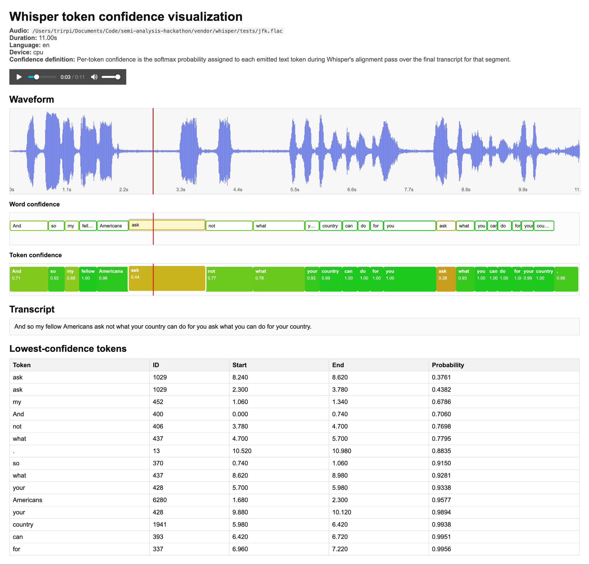
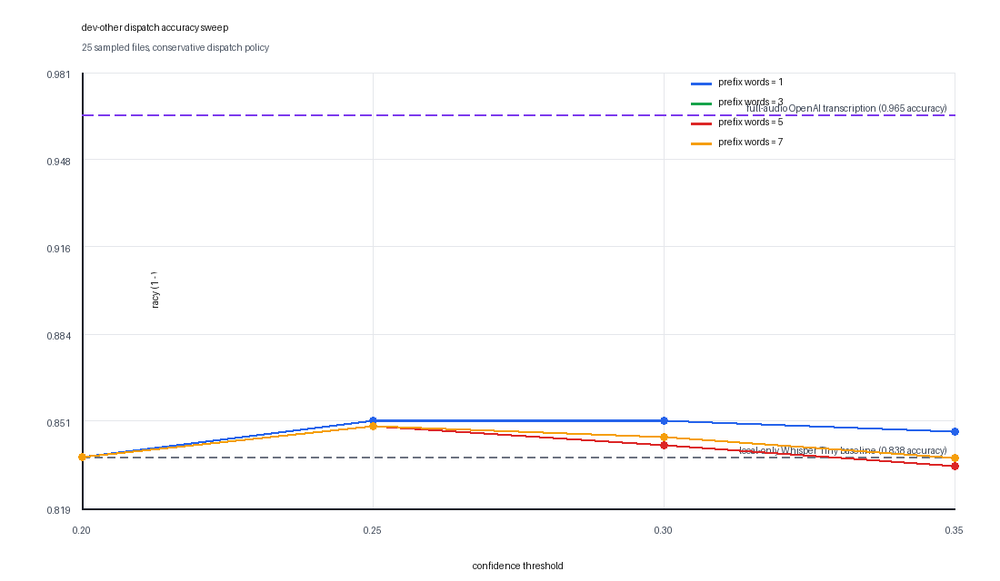
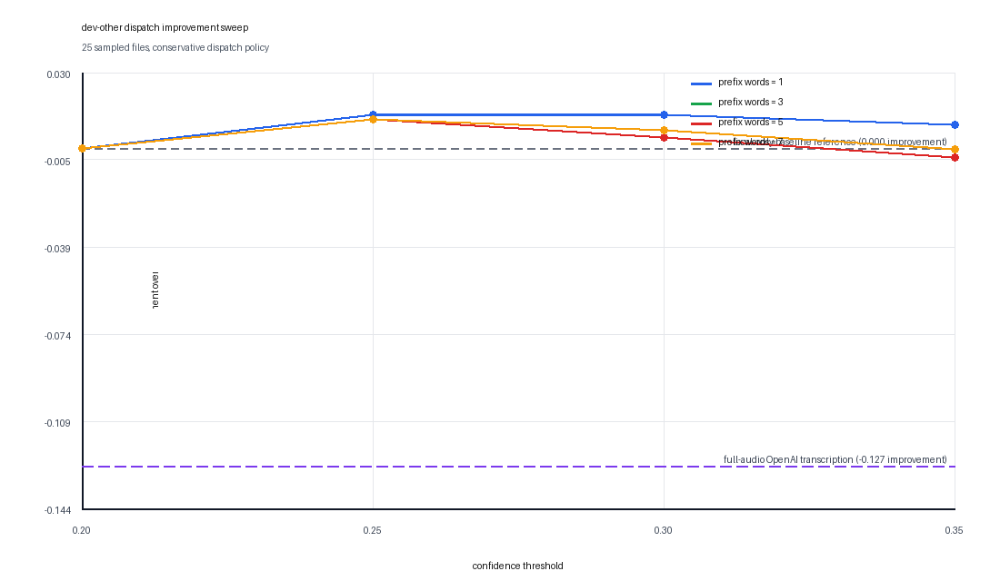

# Whisper Confidence Dispatch

This project runs the real local `openai/whisper` model first, extracts per-token confidence and timing, visualizes the result, and dispatches low-confidence spans to an online OpenAI transcription model.

The goal is quality improvement, not speed optimization.



## Benchmark Sweep

I ran a threshold and prompt-prefix sweep on a 25-file sample from LibriSpeech `dev-other` using the conservative dispatch policy.

- local-only WER: `0.161951`
- best dispatched WER: `0.148618`
- best observed improvement: `0.013333` absolute WER
- best settings in this sweep: `--threshold 0.25` or `--threshold 0.30` with `--prompt-prefix-words 1`
- full-audio OpenAI WER on the same 25-file sample: `0.034962`

The gray dashed line is the plain local Whisper Tiny run with no OpenAI fallback.
The purple dashed line is the result of sending the entire audio file through the OpenAI API, included as a reference comparison rather than a baseline.

Accuracy vs. threshold, with the local-only baseline shown explicitly:



Improvement over the local baseline:



## What It Does

1. Run Whisper Tiny locally on CPU from a vendored `openai/whisper` source tree.
2. Recover per-token timestamps and confidence scores.
3. Render an interactive HTML visualization with:
   - waveform
   - audio player
   - moving playhead
   - active word/token highlighting during playback
4. Identify low-confidence spans.
5. Optionally send only those spans to OpenAI as fallback transcription requests.

## Project Layout

```text
.
├── confidence_dispatch/
│   └── dispatch.py              # span grouping, clip export, transcript patch helpers
├── kernels/
│   ├── openai_whisper.py        # local Whisper wrapper
│   ├── vendor_whisper.py        # vendored Whisper import/cache helpers
│   └── base.py                  # optional backend interface
├── scripts/
│   ├── bootstrap_local.sh
│   ├── doctor.py
│   ├── visualize_token_confidence.py
│   ├── dispatch_low_confidence.py
│   └── prefetch_whisper_tiny.sh
├── tests/
├── vendor/whisper/              # upstream Whisper source as a git submodule
└── README.md
```

## Setup

Requirements:

- `python3`
- `ffmpeg`

Bootstrap locally:

```bash
git submodule update --init --recursive
./scripts/bootstrap_local.sh
source .venv/bin/activate
python scripts/doctor.py
```

That installs:

- local Python dependencies from `requirements.txt`
- the Whisper submodule via `git submodule update --init --recursive`
- the vendored Whisper package via `pip install -e vendor/whisper`

## Visualize Token Confidence

Run the visualizer on the bundled JFK sample:

```bash
source .venv/bin/activate
python scripts/visualize_token_confidence.py
```

Outputs:

- `results/token-confidence/jfk-token-confidence.json`
- `results/token-confidence/jfk-token-confidence.html`
- `results/token-confidence/jfk.flac`

Open the HTML file in a browser. It includes playback, a vertical playhead, and active highlighting of the current token and word.

Run on your own audio:

```bash
python scripts/visualize_token_confidence.py --audio /path/to/audio.wav
```

## Dispatch Low-Confidence Spans

Create a dry-run dispatch plan from an analysis JSON:

```bash
source .venv/bin/activate
python scripts/dispatch_low_confidence.py \
  --analysis-json results/token-confidence/jfk-token-confidence.json \
  --threshold 0.6 \
  --output results/dispatch-plan.json
```

This will:

- find tokens below the threshold
- merge nearby low-confidence tokens into spans
- add a little audio context around each span
- write a dispatch plan JSON

To actually send those spans to OpenAI:

```bash
export OPENAI_API_KEY=...
python scripts/dispatch_low_confidence.py \
  --analysis-json results/token-confidence/jfk-token-confidence.json \
  --threshold 0.6 \
  --prompt-prefix-words 3 \
  --run-openai \
  --output results/dispatch-openai.json
```

`--prompt-prefix-words` sends the previous `x` recognized words as text prompt context to the OpenAI fallback call.

Current default fallback model:

- `whisper-1`

## Benchmark On LibriSpeech `test-other`

Once you have extracted the archive, point the benchmark at either:

- the `LibriSpeech` root directory
- or directly at the `test-other` directory

Run a small local-only sample first:

```bash
source .venv/bin/activate
python scripts/benchmark_librispeech_dispatch.py \
  --input /path/to/LibriSpeech \
  --subset test-other \
  --max-files 10 \
  --threshold 0.6 \
  --output results/test-other-local.json
```

That will compare:

- the raw local Whisper transcript
- the confidence-dispatch transcript
- the LibriSpeech reference text

and report average WER for both paths.

To benchmark the actual OpenAI fallback path:

```bash
export OPENAI_API_KEY=...
python scripts/benchmark_librispeech_dispatch.py \
  --input /path/to/LibriSpeech \
  --subset test-other \
  --max-files 25 \
  --threshold 0.6 \
  --prompt-prefix-words 3 \
  --run-openai \
  --output results/test-other-openai.json
```

Recommended workflow:

- start with `--max-files 10` to check cost and behavior
- inspect the JSON output to see which spans were dispatched
- compare `--prompt-prefix-words 0` vs `--prompt-prefix-words 3`
- then increase the sample size or run the whole subset

The benchmark output includes:

- per-utterance local and dispatched transcripts
- local and dispatched WER
- number of dispatched spans
- total dispatched audio seconds
- local and dispatch wall-clock time

## Confidence Definition

The token confidence shown in the visualization is:

- the softmax probability assigned to each emitted text token during Whisper's alignment pass over the final transcript for that segment

This means the confidence values are tied to Whisper's own final token sequence, and the token timestamps come from the same alignment machinery Whisper uses for word timestamps.

## Tests

Run:

```bash
source .venv/bin/activate
python -m unittest discover -s tests -v
```

Current tests cover:

- vendored Whisper source presence
- low-confidence span grouping
- transcript patching logic for dispatched spans

## Notes

- The local-first model is real Whisper source code from `vendor/whisper`.
- `vendor/whisper` is tracked as a git submodule, so fresh clones should run `git submodule update --init --recursive`.
- The dispatch path is selective: it targets only low-confidence spans, not the whole file.
- If you want higher quality later, the next logical step is to add a transcript reconciliation policy for replacing local spans with the online model output more intelligently than simple span substitution.
